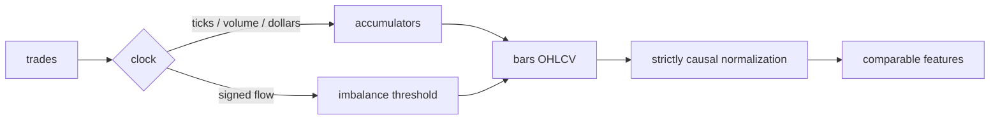

# bar-forge

[](https://github.com/bmouler/bar-forge/actions/workflows/ci.yml)


[](LICENSE)

Build market data bars on an activity clock instead of a wall clock, and normalise the
resulting features without leaking the future.

## Why this exists

A one-minute bar at 09:31 and a one-minute bar at 13:47 are not comparable
observations: one may contain a thousand trades and the other five. Feeding both to a
model as equally weighted rows is the failure mode this library prevents. Clock
sampling produces returns with fat tails, volatility clustering and serial dependence,
which breaks the independence assumptions that sit underneath most model fitting and
cross-validation. Sampling on traded activity instead restores much of that structure,
and it costs a few lines of code rather than a new model.

The second half of the library is the other half of the same problem. Once bars are
built, features have to be put on a common scale before instruments can share a model,
and every rolling transform is an opportunity to accidentally use tomorrow's data. Every
transform in `bar_forge.normalize` is strictly causal, and the property is asserted
directly rather than assumed.

## Install

```bash
python -m pip install bar-forge
```

For editable development, clone the repository and install the development dependencies:

```bash
python -m pip install -e ".[dev]"
```

Python 3.11 or newer. The only runtime dependency is numpy.

## Quickstart

Compare every bar type on one synthetic trade stream, each calibrated to produce a
comparable number of bars:

```
bar-forge compare --n-trades 200000 --seed 7
```

```
bar-forge compare: 200000 synthetic trades, seed 7, target 500 bars per type

          bar type   threshold   bars   mean ret   std ret  exc kurt  |ac(1)|          JB
-----------------------------------------------------------------------------------------
time                     125.2    500  +2.17e-04 1.504e-02     2.401   0.0100       120.1
tick                       400    500  +1.70e-04 1.498e-02     0.438   0.0230         4.0
volume                3.61e+04    498  +1.66e-04 1.451e-02    -0.143   0.0573         0.4
dollar               3.203e+06    497  +1.85e-04 1.464e-02    -0.117   0.0381         5.0
tick imbalance              21    489  +1.01e-04 1.391e-02    -0.105   0.0834         2.7
volume imbalance          3072    497  +1.35e-04 1.477e-02     0.338   0.0120         3.4

Lowest Jarque-Bera: volume bars at 0.4 versus 120.1 for time bars (283.9x).
```

Read the `exc kurt` and `JB` columns. On the same 200,000 trades, sampled to the same
number of bars, clock time leaves excess kurtosis at 2.40 and a Jarque-Bera statistic of
120.1; sampling on volume brings those to -0.14 and 0.4. Nothing about the price process
changed, only where the bars were cut. Add `--json` for machine-readable output.

Using the library directly:

```python
from bar_forge import atr_normalize, dollar_bars, generate_trades, tick_rule_signs

trades = generate_trades(50_000, seed=7)
bars = dollar_bars(trades, dollars_per_bar=1_000_000.0)

print(f"{len(trades)} trades -> {len(bars)} dollar bars")
print(f"first bar: close={bars[0].close:.2f} vwap={bars[0].vwap:.4f} ticks={bars[0].trade_count}")

signed = atr_normalize(bars, window=20)
print(f"ATR-normalised move at bar 40: {signed[40]:+.4f} average true ranges")

signs = tick_rule_signs(trades)
print(f"buy-initiated share under the tick rule: {sum(s > 0 for s in signs) / len(signs):.3f}")
```

```
50000 trades -> 383 dollar bars
first bar: close=98.77 vwap=99.0473 ticks=88
ATR-normalised move at bar 40: -0.7173 average true ranges
buy-initiated share under the tick rule: 0.497
```

Run the test suite, including the causality proofs:

```
python -m pytest -q
```

## How it works



### Bar construction

Every constructor in `bar_forge.bars` consumes an iterable of `Trade(timestamp, price,
size)` and returns a list of frozen `Bar` records carrying `start_time`, `end_time`,
`open`, `high`, `low`, `close`, `volume`, `notional`, `trade_count` and `vwap`. They
differ only in what closes a bar.

| Constructor | Bar closes when |
| --- | --- |
| `time_bars(trades, interval)` | the clock crosses a grid boundary at `floor(timestamp / interval)` |
| `tick_bars(trades, n_ticks)` | `n_ticks` trades have arrived |
| `volume_bars(trades, volume_per_bar)` | cumulative size reaches `volume_per_bar` |
| `dollar_bars(trades, dollars_per_bar)` | cumulative `price * size` reaches `dollars_per_bar` |
| `tick_imbalance_bars(trades, expected_imbalance)` | `abs(sum(sign))` reaches the threshold |
| `volume_imbalance_bars(trades, expected_imbalance)` | `abs(sum(sign * size))` reaches the threshold |

The trade that trips a threshold is kept whole rather than split, so volume and dollar
bars overshoot slightly. Time bars are anchored at zero on the trade clock rather than at
the first trade, so two instruments sampled with the same `interval` share boundaries; an
interval with no trades produces no bar rather than an empty one.

**Why dollar bars.** Tick bars ignore trade size, so they are sensitive to how a broker
slices an order: the same institutional print chopped into ten child orders produces ten
times the sampling events. Volume bars fix that but count quantity, which is not a
stable unit over time. If a stock doubles in price and volume halves, volume bars
sample half as often for exactly the same economic activity, and a 2-for-1 split
mechanically doubles the sampling rate overnight. Dollar bars count money changing hands.
Notional is invariant to how quantity is redefined, so the sampling rate tracks economic
participation across price-level drift, splits and long histories. That is why dollar
bars are the sensible default when you want one threshold to work over years of data.

**The tick rule.** Imbalance bars need a side for each trade, and public trade feeds
often do not carry one. The tick rule infers it from price change alone:

- `price > previous price` gives `+1`, buyer-initiated
- `price < previous price` gives `-1`, seller-initiated
- `price == previous price` carries the previous sign forward
- the first trade of a stream has no predecessor and is signed `+1` by convention

The carry-forward on a zero tick is the part that matters. On a tick-size grid a large
share of prints trade at the previous price, and signing those as zero would discard most
of the flow. `tick_rule_signs` exposes the signs directly. Tick-rule state carries across
bar boundaries, because it is a property of the trade stream rather than of a bar.

**The trailing bar.** Every constructor takes `include_partial: bool = False`. The
leftover accumulation at the end of a stream is a bar whose sampling condition never
fired. It is returned only when you ask for it, and it is never silently dropped from a
count or silently mixed in with complete bars. For time bars the final clock interval is
always treated as partial, because a stream that ends mid-interval is indistinguishable
from one that ends on a boundary.

### Causal normalisation

`bar_forge.normalize` maps bar features onto a comparable scale. Every function returns
an array the same length as its input, with `nan` wherever the trailing window is not yet
full, so a partially populated estimate cannot masquerade as a real one.

- `zscore(values, window)` subtracts the mean and divides by the sample standard
  deviation of the window ending at and including `t`.
- `rank_normalize(values, window)` returns the tie-averaged percentile rank of
  `values[t]` within that window, in `[0, 1]`. Magnitude is discarded, which is what you
  want when instruments have incomparable tails.
- `volume_normalize(bars)` divides each bar's log return by that bar's volume.
- `atr_normalize(bars, window)` divides each bar's price change by the average true range
  of the `window` bars *before* it. Numerator and denominator are both in price units, so
  the result is dimensionless: 1.0 means a one-ATR move, comparable across any two
  instruments regardless of price level or tick size.

The current bar's own true range is deliberately excluded from its denominator. Including
it shrinks exactly the observations you care about, and it is the most common way a
harmless-looking volatility normalisation quietly eats its own signal.

The causality property is not documentation, it is a test. `tests/test_causality.py`
asserts, for every transform and many prefix lengths, that `f(x)[:k]` is bit-identical to
`f(x[:k])`, and separately that replacing everything after `k` with values from a
completely different distribution leaves the first `k` outputs untouched. The same file
runs a centred z-score through the same assertions and confirms that it fails, so the
test is known to have teeth.

### Measurement

`bar_statistics(bars)` reports bar count, mean and standard deviation of close-to-close
log returns, excess kurtosis, absolute lag-1 autocorrelation, and the Jarque-Bera
statistic, all implemented directly on numpy. Excess kurtosis and Jarque-Bera are
reported as raw statistics. They are diagnostics for how far a sample sits from
Gaussian, not hypothesis tests, and no p-value is attached to them.

`generate_trades(n, seed, ...)` produces the reproducible synthetic stream used by the
CLI and the tests: a driftless random-walk mid rounded to a tick grid, Poisson arrivals,
lognormal sizes, and activity bursts during which arrival rate, size and volatility all
jump together. That last feature is what makes activity bars visibly diverge from time
bars. Identical seeds give identical streams.

## Verification

### End-to-end performance

`PYTHONPATH=src python benchmarks/benchmark_pipeline.py --json` times public
`dollar_bars` construction followed by causal `atr_normalize` across eight instruments and
240,000 trades. Fixture generation, threshold calibration, and interpreter startup are outside
the timed region; all `Bar` objects and normalized arrays are materialized inside it, and the
validation checksum covers every field and array byte.

On an Apple M3 Max with CPython 3.11.12 on 2026-08-15, 15 samples after three warmups measured
the frozen baseline `87376cfa3890` at **46.407 ms** median and this implementation at
**21.685 ms**, a **2.140x speedup**. Both runs produced SHA-256
`3a406097462c8a3b12bcd078ff2032e5aac08e38adc22ca7afa0f1643f82f7ee`. These are local
in-process timings, not a portability guarantee; rerun the command on the target machine and
point `PYTHONPATH` at a worktree of the baseline commit for a direct comparison.

### Mutation testing

From the repository root, reproduce the mutation run with:

```console
source .venv/bin/activate
mutmut run
mutmut results
```

The completed run generated 1,208 mutants and killed 1,123 (92.96%). The 85
remaining survivors were reviewed individually and are behavior-equivalent under the
public contract, rather than missed mutants:

| Equivalent rationale | Count |
|---|---:|
| NumPy dtype and fill-value identities | 38 |
| `zip(strict=...)` changes over internally guaranteed equal-length inputs | 9 |
| Algebraically symmetric signed-imbalance comparisons | 2 |
| Sentinel, default-value, and runtime cast identities | 20 |
| Non-contractual diagnostic formatting differences | 16 |
| **Total reviewed equivalents** | **85** |

There were zero suspicious mutants and zero timeouts.

## Limitations

- Imbalance bars use a fixed threshold rather than a running forecast of expected
  imbalance. This keeps the transform stateless and reproducible, but the threshold has
  to be recalibrated per instrument and per regime. The CLI shows one way to do it, by
  bisecting on the realised bar count.
- The tick rule is a heuristic. Where the feed carries a real aggressor flag, use it; the
  tick rule misclassifies trades inside the spread and at price reversals.
- `volume_normalize` still carries the instrument's volume unit and is not comparable
  across instruments on its own. Compose it with `zscore` or `rank_normalize`.
- Bars overshoot their threshold by up to one trade, because trades are not split. With
  thresholds much larger than a typical trade this is negligible; with small thresholds it
  is not.
- `rank_normalize` materialises a window matrix and uses `O(len(values) * window)` memory.
- Constructors return lists rather than streaming generators, so a full stream is held in
  memory. Chunk long histories yourself.
- The synthetic generator is a deliberately simple model. It is there so examples and
  tests run offline and deterministically, not to reproduce real microstructure.

## Non-goals

- **No strategy logic.** No signals, no position sizing, no execution, no backtester. This
  library builds bars and features and stops there.
- **No data acquisition.** No vendor clients, no downloads, no caching layer. Bring your
  own trades.
- **No multiple-testing machinery.** No probability of backtest overfitting, no deflated
  performance statistics, no p-value corrections. Validation belongs in held-out data
  across instruments and periods, not in an adjustment applied to an in-sample number.
- **No pandas or scipy dependency.** Plain sequences and numpy arrays in, numpy arrays
  out. Converting to a DataFrame at the boundary is one line and is your choice, not this
  library's.
- **No inferred labels or targets.** Triple-barrier labelling, meta-labelling and sample
  weighting are downstream concerns and out of scope.

## License

MIT. See [LICENSE](LICENSE).